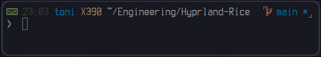

# ZSH configuration

Simple customization of my [zsh](https://www.zsh.org/) shell, **without** [oh-my-zsh](https://ohmyz.sh/).

<kbd></kbd>

## Features

- [x] Auto suggestions
- [x] Syntax highlighting
- [x] VI mode
- [x] Git status

> [!IMPORTANT]
> All plugins will be installed automatically at the first start.

## Installation

Simply clone this repository into your user config folder and take care, that the `.zshrc` will be loaded:

```sh
git clone https://github.com/tonigineer/zsh.git ~/.config/zsh

# Symlink .zshrc (alt: set ZDOTDIR in env)
ln -s ~/.config/zsh/.zshrc ~/.zshrc
```

> [!NOTE]
> [Have a look](https://github.com/tonigineer/.dotfiles) at my [Hyprland](https://hyprland.org/) configuration.
